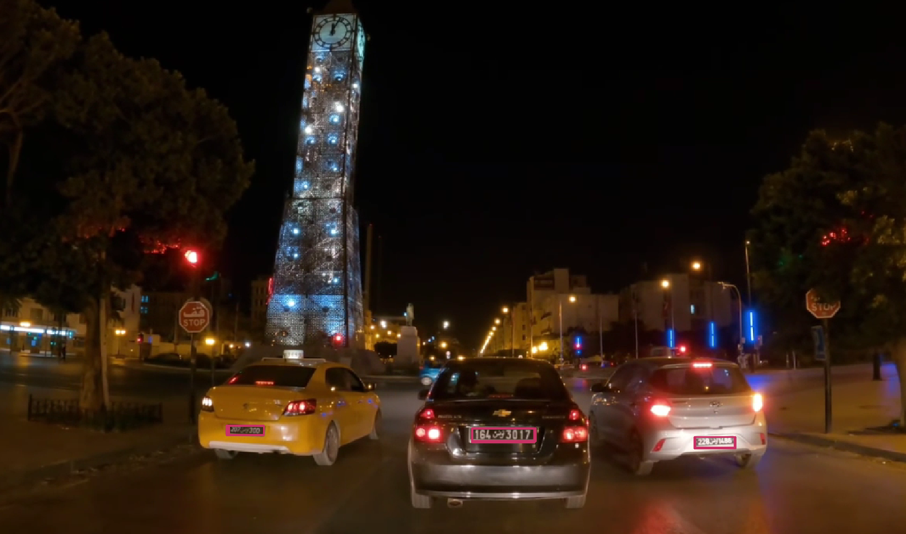

# Tunisian Car License Plate Detection using YOLOv8 🚗📋🇹🇳:

This repository contains a fine-tuned YOLOv8 model for detecting car license plates in tunisia. The model has been trained and optimized for accurate plate detection in various environments. The `tn_car_license_plate.pt` file provided here contains the trained weights of the model.



## Overview
This project uses the YOLOv8 architecture to detect car license plates. YOLOv8 is a powerful and efficient object detection framework that achieves state-of-the-art results while being lightweight and fast.

The fine-tuned model is suitable for:
- Real-time car plate detection.

---

## Getting Started

### Requirements
- Python
- PyTorch
- `ultralytics` package (for YOLOv8)

### Installation
1. Clone this repository:
   ```bash
   git clone https://github.com/dhia619/Licence-plate-detector-TN
   ```
2. Install dependencies:
    ```bash
    pip install -r requirements.txt
    ```

### Usage
1. Loading the Model:
    ```python
    from ultralytics import 
    model = YOLO("tn_car_license_plate.pt")
    ```
2. Running Inference:
    ```python
    # Run inference on an image
    results = model("path/to/your/image.jpg")
    ```
    
    ```python
    # Run inference on a video
    results = model("path/to/your/video.mp4", save=True)
    # Output video with detections saved in the `runs/detect` directory
    ```
### Dataset
- collected 104 images from different videos, images were taken from different angles and in different lighting conditions.
- Manually labeled the images using [Make Sense](https://www.makesense.ai/).

### Training details:
- **Model** : YOLOv8 medium
- **Epochs** : 15
- **Training images** : 104
